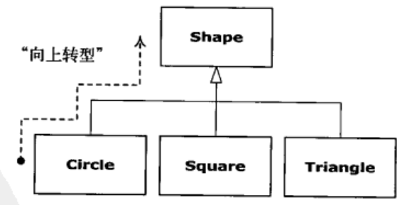

### 1.对象导论
##### 1.1进行抽象
面向对象的五个基本特征

1. 万物皆对象
2. 程序时对象的集合，它们通过发消息来告诉彼此所要做的。
3. 每个对象都有自己的由其他对象所构成的存储。
4. 每个对象都拥有其类型。
5. 某一特定类型的所有对象都可以接受同样的消息。

##### 1.2每个对象都有一个接口
类描述了具有相同特性（数据元素）和行为（功能）的对象集合。

像某个对象“发送消息”,这个对象便知道此消息的目的，然后执行对应的程序代码。

##### 1.3每个对象都提供服务
将对象想象为“服务提供者”，程序本身向用户提供服务，它通过调用其他对象提供的服务来实现这一目的。

将对象看做是服务提供者还附带一个好处：提高程序的内聚性。

每个对象都能很好的完成一项任务。

##### 1.4被隐藏的具体实现
类需要进行部分隐藏，这样在使用者（客户端程序员），使用的时候，不用访问一些不必要的东西，通过一些你想让他知道的公开的内容，进行开发，这样子，当自己修改哪些隐藏内容的时候，使用者（客户端程序员）就能无感知的使用。

访问控制的第一个存在原因就是让客户端程序员无法触及他们不应该触及的部分————这部分对数据类型的内部操作来说是必须的，但并不是用户解决特定问题所需要的接口的一部分。

控制访问符的第二个存在原因就是允许库设计者可以改变内部工作方式而不用担心会影响到客户端程序员。

在Java中，主要使用关键字进行限定范围：

| 限定符    | 本类  | 本包的类  | 子类 | 非子类的外包类  |
|:---------:|:----:|:--------:|:----:|:--------------:|
|  public   |  √   |    √     |  √   |       √        |
| protected |  √   |    √     |  √   |                |
|  default  |  √   |    √     |      |                |
|  private  |  √   |          |      |                |

其中default 并没有这个修饰符，但是在java8中可以修饰接口方法，并且方法可以有实现体，子类也无需在重新实现这个方法，这个做法是为了兼容其他实现了集合接口的第三方，因为在Jav8中，集合中增加了“流”，如果没有default，第三方库要崩溃。

##### 1.5复用具体实现
在使用现在有的类合成新的类，所以这种概念被称为组合，如果组合是动态发生的，那么它通常被称为聚合。

组合经常被视为“has-a”（拥有）关系。

##### 1.6继承
“是一个”与“像是一个”关系。

如果在一个子类中，只覆盖基类的方法（而并不添加在基类中没有的新方法），就意味着导出类和基类是完全相同的类型，因为他们具有相同的接口。

如果一个导出对象来完全替代一个基类对象，这种情况称为：纯粹替代，通常称之为替代原则。

在某种意义上，“纯粹替代”是一种处理继承的理想方式，通常在这种情况下的基类与导出类之间的关系称为“is-a”（是一个）的关系。

但是一般，导出类都会添加新的接口进行扩展，但是基类却无法访问。这种情况称之为“is-like-a”（像是一个）的关系。

##### 1.7伴随多态的可互换对象

一个非面向对象编程的编译器产生的函数调用会引起所谓的前期绑定，这么做就意味着编译器将产生对一个具体函数名字的调用，而运行时将这个调用解析到将要被执行的代码的绝对地址。

在OOP中，程序直到运行的时候，才能够确定代码的地址。

OOP采用了后期绑定的概念。当向对象发送消息的时候，被调用的代码直到运行时才能确定。

因此，即使是使用父类的引用，调用子类对象，也能产生正确的动作。

把导出类看做是它的基类的过程称为向上转型（upcasting），向上转型是安全的。

向下转型为基类转出为导出类，获得更多能力，向下转型是非安全的。

##### 1.8单根继承结构
在Java中，继承结构体系是单根的，也就是只能继承一个父类。

在没有显式写出来继承的时候，都会默认继承`java.lang.Object`

##### 1.9容器
